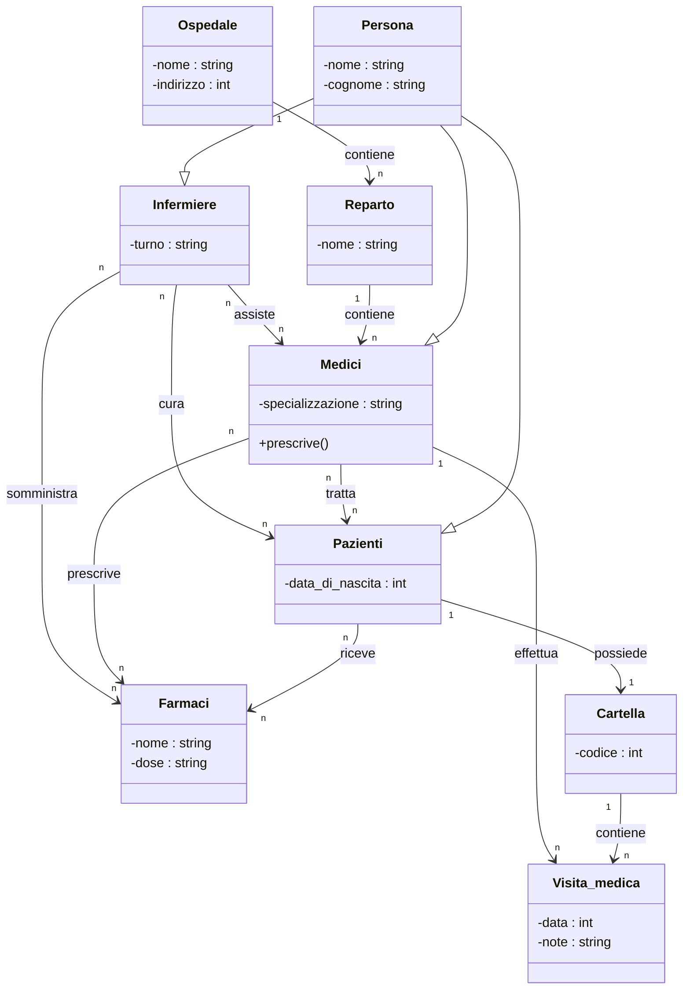

```mermaid
classDiagram
    class Persona {
        -nome : string
        -cognome : string
    }

    class Ospedale {
        -nome : string
        -indirizzo : int
    }
    
    class Reparto {
        -nome : string
    }
    class Medici {
        
        -specializzazione : string
        +prescrive()
        
    }
    
    class Pazienti {
        
        -data_di_nascita : int
    }


    class Infermiere {
        -turno  : string
    }

    class Farmaci {
        -nome : string
        -dose : string
        
    }
   
    class Cartella {
        -codice : int
        
    }
    class Visita_medica {
        -data : int
        -note : string

    }
    

    Infermiere "n" --> "n" Medici : assiste
    Infermiere "n" --> "n" Pazienti : cura
    Infermiere "n" --> "n" Farmaci : somministra

    Ospedale "1" --> "n" Reparto : contiene
    Reparto "1" --> "n" Medici : contiene
    Medici "n" --> "n" Farmaci : prescrive
    Medici "n" --> "n" Pazienti : tratta
    Pazienti "n" --> "n" Farmaci : riceve

    
    

    Medici "1" --> "n" Visita_medica : effettua

    Persona --|> Medici 
    Persona --|> Pazienti 
    Persona --|> Infermiere 

    Cartella "1" --> "n" Visita_medica : contiene

    Pazienti "1" --> "1" Cartella : possiede


```
