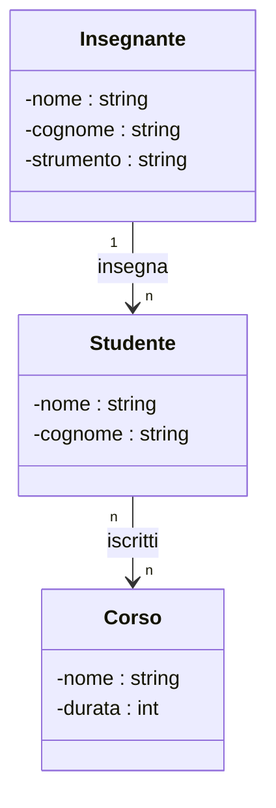

```mermaid
classDiagram
    class Insegnante {
        -nome : string
        -cognome : string
        -strumento : string
        
    }
    
    class Studente {
        -nome : string
        -cognome : string
        
    }

    class Corso {
        -nome : string
        -durata : int
    }
    

    

    Insegnante "1" --> "n" Studente : insegna
    Studente "n" --> "n" Corso : iscritti

    
```