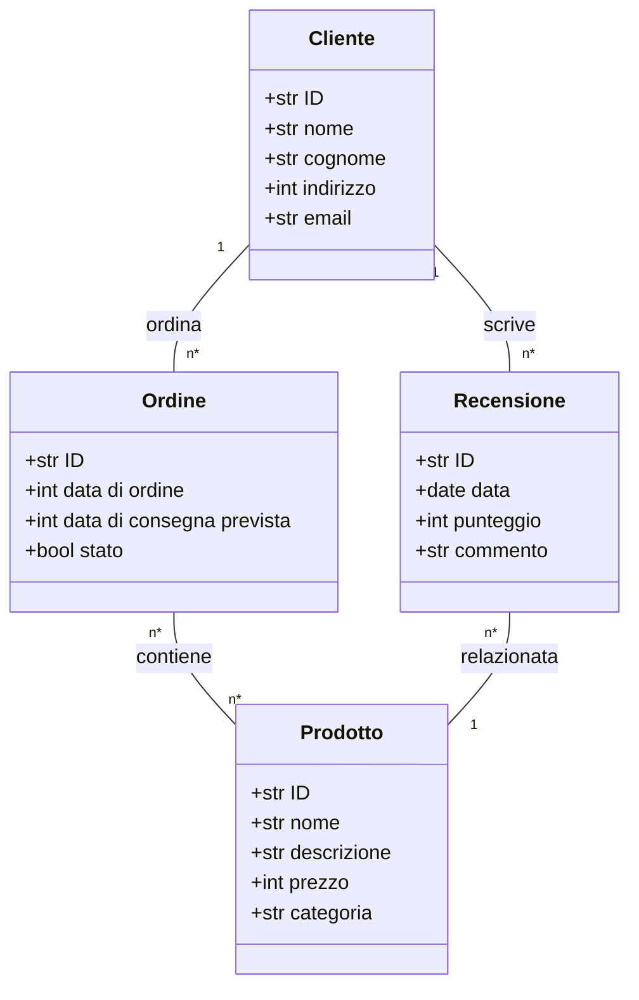

```mermaid
classDiagram
    class Prodotto{
        +str ID
        +str nome
        +str descrizione
        +int prezzo 
        +str categoria
    }

    class Cliente{
        +str ID
        +str nome
        +str cognome
        +int indirizzo 
        +str email
    }

    class Ordine{
        +str ID
        +int data di ordine 
        +int data di consegna prevista
        +bool stato
    }

    class Recensione{
        +str ID
        +date data 
        +int punteggio 
        +str commento
    }

    Cliente "1" -- "n*" Ordine : ordina
    Ordine "n*" -- "n*" Prodotto : contiene
    Cliente "1" -- "n*" Recensione : scrive
    Recensione "n*" -- "1" Prodotto : relazionata
    
```