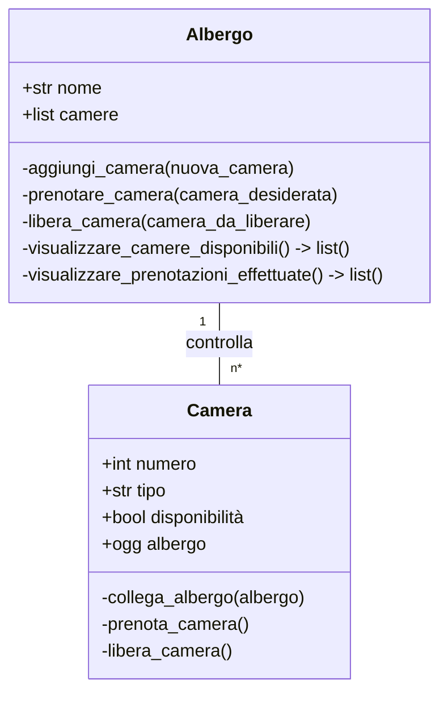

```mermaid
classDiagram
    class Camera{
        +int numero
        +str tipo
        +bool disponibilità
        +ogg albergo
        -collega_albergo(albergo) 
        -prenota_camera()
        -libera_camera()
    }

    class Albergo{
        
        +str nome
        +list camere
        
        -aggiungi_camera(nuova_camera)
        -prenotare_camera(camera_desiderata)
        -libera_camera(camera_da_liberare)
        -visualizzare_camere_disponibili() -> list()
        -visualizzare_prenotazioni_effettuate() -> list()
    }
    Albergo "1" -- "n*" Camera : controlla

    
```