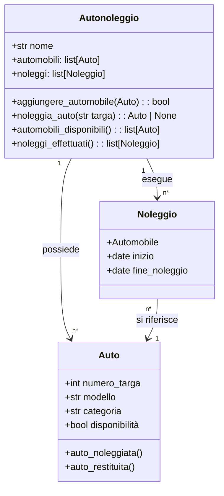

```mermaid
classDiagram
    class Autonoleggio{
        +str nome
        +automobili: list[Auto]
        +noleggi: list[Noleggio]
        +aggiungere_automobile(Auto): bool
        +noleggia_auto(str targa): Auto | None
        +automobili_disponibili(): list[Auto]
        +noleggi_effettuati(): list[Noleggio]

    }

    class Noleggio{
        +Automobile
        +date inizio
        +date fine_noleggio
        

    }

    class Auto{
        +int numero_targa
        +str modello
        +str categoria
        +bool disponibilità
        +auto_noleggiata()
        +auto_restituita()
         
    }
    Autonoleggio "1" --> "n*" Noleggio : esegue
    Autonoleggio "1" --> "n*" Auto : possiede
    Noleggio "n*" --> "1" Auto : si riferisce


    
```