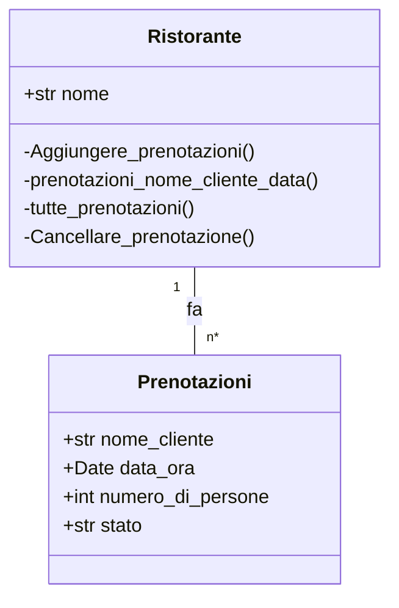

```mermaid
classDiagram
    class Prenotazioni{
        +str nome_cliente
        +Date data_ora
        +int numero_di_persone
        +str stato
    
    }
    class Ristorante{
        +str nome
        -Aggiungere_prenotazioni()
        -prenotazioni_nome_cliente_data()
        -tutte_prenotazioni()
        -Cancellare_prenotazione()
    }
    Ristorante"1" -- "n*" Prenotazioni : fa

    
```