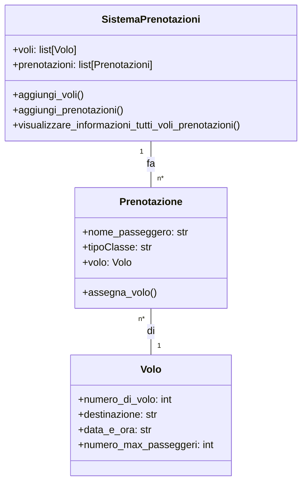

```mermaid
classDiagram
    class Volo{
        +numero_di_volo: int 
        +destinazione: str 
        +data_e_ora: str 
        +numero_max_passeggeri: int
    
    }
    class Prenotazione{
        +nome_passeggero: str
        +tipoClasse: str
        +volo: Volo
        +assegna_volo()
    }
    class SistemaPrenotazioni{
        +voli: list[Volo]
        +prenotazioni: list[Prenotazioni]
        +aggiungi_voli()
        +aggiungi_prenotazioni()
        +visualizzare_informazioni_tutti_voli_prenotazioni()
        
    
    }
    SistemaPrenotazioni"1" -- "n*" Prenotazione : fa
    Prenotazione"n*" -- "1" Volo : di

    
```