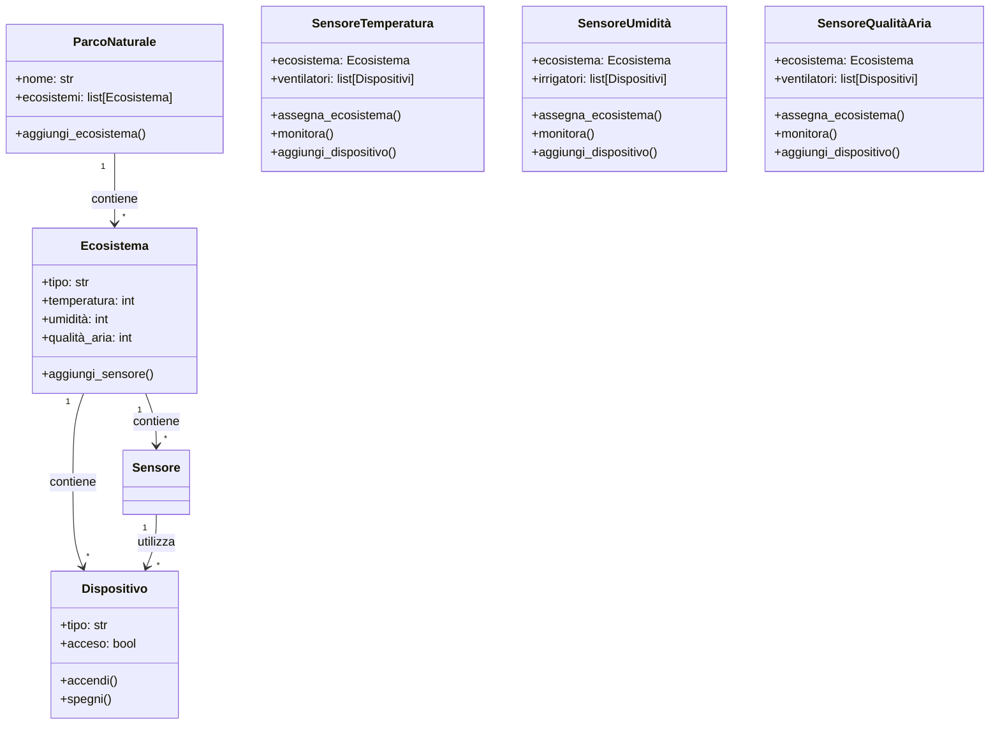

```mermaid
classDiagram
    class ParcoNaturale{
        +nome: str
        +ecosistemi: list[Ecosistema]
        +aggiungi_ecosistema()
    }

    class Ecosistema{
        +tipo: str 
        %%tra cui foreste, zone umide e praterie

        +temperatura: int
        +umidità: int
        +qualità_aria: int
        +aggiungi_sensore()
        
    
    }

    class SensoreTemperatura{
        +ecosistema: Ecosistema 
        %%temperatura, umidità, qualità dell'aria
        +ventilatori: list[Dispositivi]
        +assegna_ecosistema()
        +monitora()
        +aggiungi_dispositivo()

    }
        class SensoreUmidità{
        +ecosistema: Ecosistema 
        %%temperatura, umidità, qualità dell'aria
        +irrigatori: list[Dispositivi]
        +assegna_ecosistema()
        +monitora()
        +aggiungi_dispositivo()

    }
        class SensoreQualitàAria{
        +ecosistema: Ecosistema 
        %%temperatura, umidità, qualità dell'aria
        +ventilatori: list[Dispositivi]
        +assegna_ecosistema()
        +monitora()
        +aggiungi_dispositivo()

    }

    class Dispositivo{
        +tipo: str 
        %%irrigatori, ventilatori e luci
        +acceso: bool
        +accendi()
        +spegni()
    }

    ParcoNaturale "1" --> "*" Ecosistema : contiene
    Ecosistema "1" --> "*" Sensore : contiene
    Ecosistema "1" --> "*" Dispositivo : contiene
    Sensore "1" --> "*" Dispositivo : utilizza
    
```