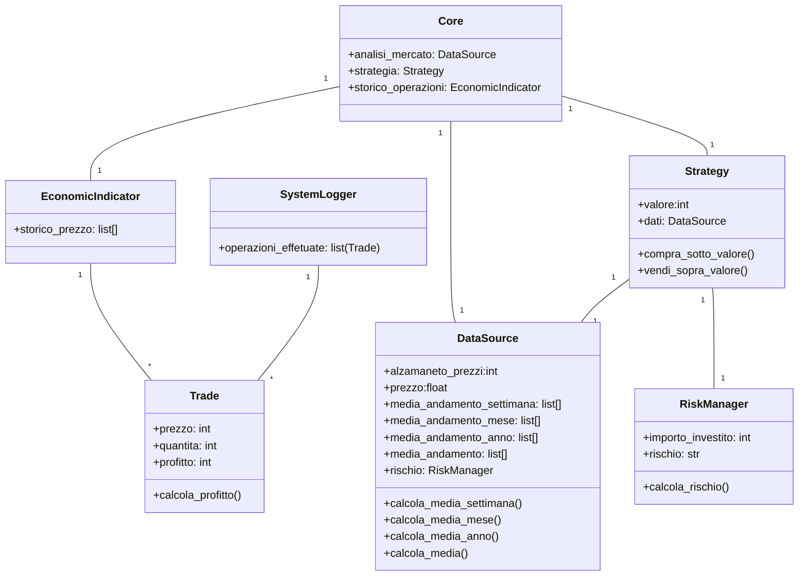

```mermaid
classDiagram
    class Core{
        
        +analisi_mercato: DataSource
        +strategia: Strategy
        +storico_operazioni: EconomicIndicator
        
    }

    class RiskManager{
        +importo_investito: int
        +rischio: str
        +calcola_rischio()
    }

    class DataSource{
        +alzamaneto_prezzi:int
        +prezzo:float
        +media_andamento_settimana: list[]
        +media_andamento_mese: list[]
        +media_andamento_anno: list[]
        +media_andamento: list[]
        +rischio: RiskManager

        +calcola_media_settimana()
        +calcola_media_mese()
        +calcola_media_anno()
        +calcola_media()

    }

    class Trade{
        +prezzo: int
        +quantita: int
        +profitto: int
        +calcola_profitto()
    }

    class EconomicIndicator{
        +storico_prezzo: list[]

        
    }

    class SystemLogger{
        +operazioni_effetuate: list(Trade)
    }

    class Strategy{
        +valore:int
        +dati: DataSource
        +compra_sotto_valore()
        +vendi_sopra_valore()
    }

    Core "1" -- "1" EconomicIndicator
    EconomicIndicator "1" -- "*" Trade
    Core "1" -- "1" DataSource
    Core "1" -- "1" Strategy
    Strategy "1" -- "1" DataSource
    SystemLogger "1" -- "*" Trade
    Strategy "1" -- "1" RiskManager

    


```