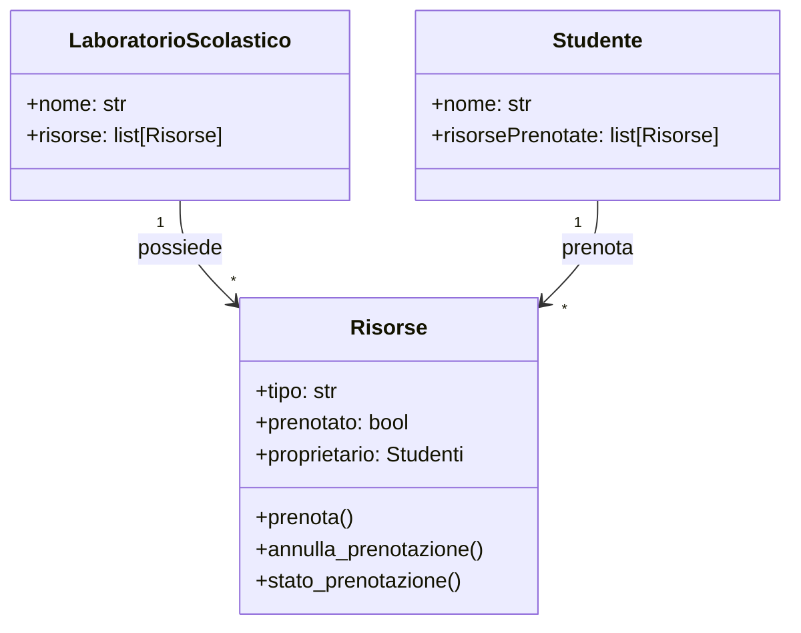

```mermaid
classDiagram
    class LaboratorioScolastico{
        +nome: str
        +risorse: list[Risorse]

    }
    class Studente{
        +nome: str
        +risorsePrenotate: list[Risorse]
    }
    
    class Risorse{
        +tipo: str
        +prenotato: bool
        +proprietario: Studenti
        +prenota()
        +annulla_prenotazione()
        +stato_prenotazione()
    }
    LaboratorioScolastico "1" --> "*" Risorse : possiede
    Studente "1" --> "*" Risorse : prenota

    
```