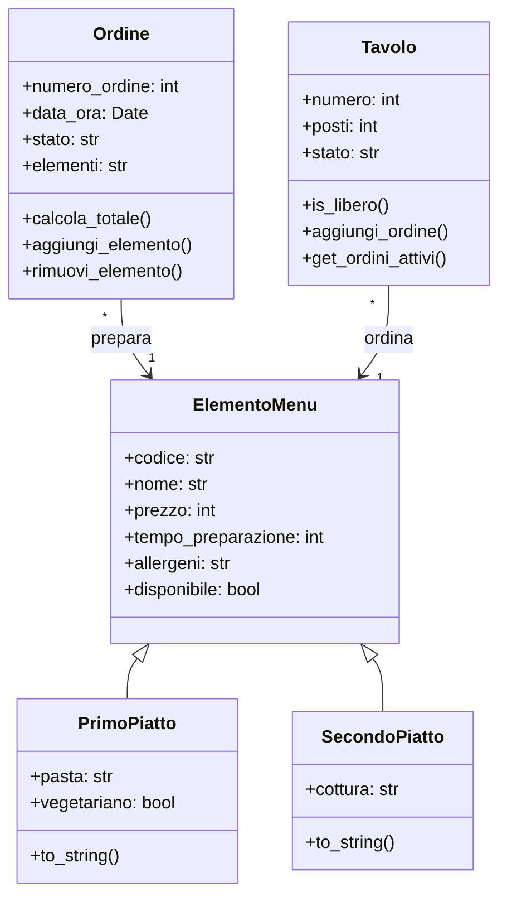

```mermaid
classDiagram
    
    class ElementoMenu{
        +codice: str
        +nome: str
        +prezzo: int
        +tempo_preparazione: int
        +allergeni: str
        +disponibile: bool
    }
    
    class PrimoPiatto{
        +pasta: str
        +vegetariano: bool
        +to_string()
    }
    
    class SecondoPiatto{
        +cottura: str
        +to_string()
    }
    %%"in_attesa", "in_preparazione", "pronto", "servito"
    class Ordine{
        +numero_ordine: int
        +data_ora: Date
        +stato: str 
        +elementi: str
        +calcola_totale()
        +aggiungi_elemento()
        +rimuovi_elemento()
       
    }

    class Tavolo{
        +numero: int
        +posti: int
        +stato: str
        +is_libero()
        +aggiungi_ordine()
        +get_ordini_attivi()
    }


    ElementoMenu <|-- PrimoPiatto
    ElementoMenu <|-- SecondoPiatto
    Ordine "*" --> "1" ElementoMenu : prepara
    Tavolo "*" --> "1" ElementoMenu : ordina
```