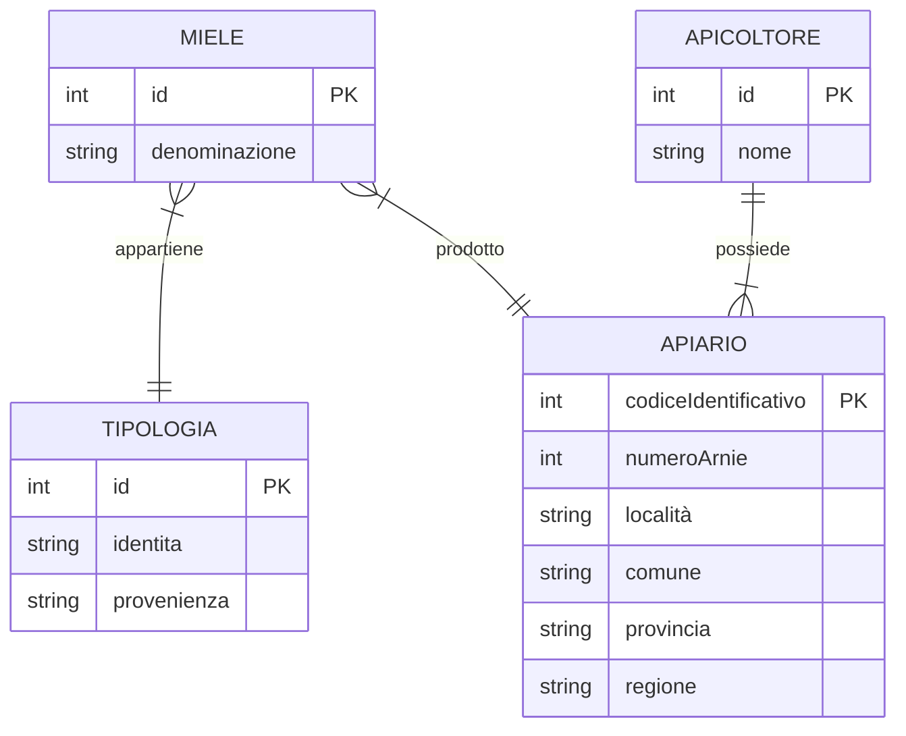

```mermaid
erDiagram
    TIPOLOGIA{
        int id PK
        string identita
        string provenienza
    }

    MIELE{
        int id PK
        string denominazione
    }

    APIARIO{
        int codiceIdentificativo PK
        int numeroArnie
        string località
        string comune
        string provincia
        string regione
    }

    APICOLTORE{
        int id PK
        string nome
    }

    MIELE }|--|| TIPOLOGIA :  appartiene
    MIELE }|--|| APIARIO : prodotto
    APICOLTORE ||--|{ APIARIO : possiede
    

```