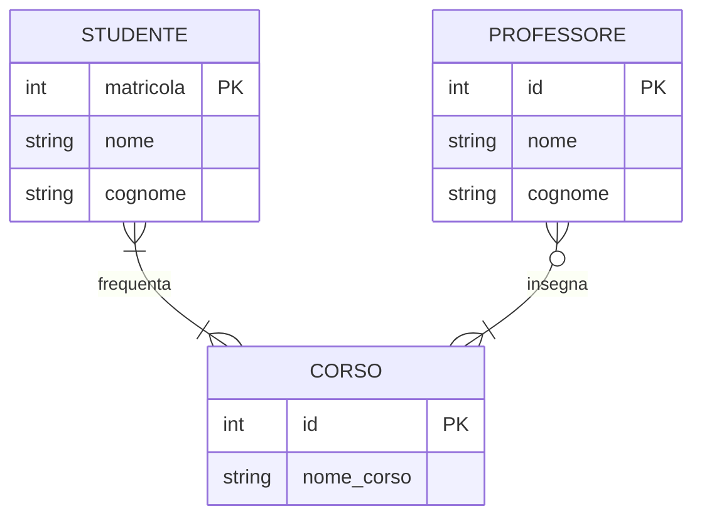

```mermaid
erDiagram
    CORSO {
        int id PK
        string nome_corso
    }
    STUDENTE {
        int matricola PK
        string nome
        string cognome
    }
    PROFESSORE {
        int id PK
        string nome
        string cognome
    }

    STUDENTE }|--|{ CORSO : frequenta
    PROFESSORE }o--|{ CORSO : insegna
    
```